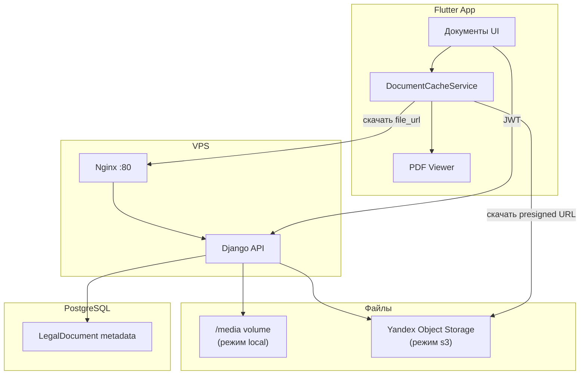

# Object Storage и офлайн-документы

## Архитектура



| Слой | Роль |
|------|------|
| **PostgreSQL** | название, slug, размер, `updated_at` — для списка и инвалидации кэша |
| **Object Storage / media** | PDF-файлы (бинарники) |
| **Django API** | `GET /api/documents/`, `GET /api/documents/offline-manifest/` |
| **Flutter cache** | скачивание на диск телефона, чтение без сети |

---

## Режимы хранения

### Local (по умолчанию, для разработки)

```env
USE_OBJECT_STORAGE=false
PUBLIC_MEDIA_BASE_URL=http://158.160.176.80
```

Файлы в Docker volume `media_data` → nginx `/media/...`.

### Yandex Object Storage (прод)

```env
USE_OBJECT_STORAGE=true
AWS_ACCESS_KEY_ID=...
AWS_SECRET_ACCESS_KEY=...
AWS_STORAGE_BUCKET_NAME=ontoalert-docs
AWS_S3_ENDPOINT_URL=https://storage.yandexcloud.net
AWS_S3_REGION_NAME=ru-central1
AWS_LOCATION=media
AWS_QUERYSTRING_AUTH=true
PUBLIC_MEDIA_BASE_URL=
```

Django отдаёт **presigned URL** (временная ссылка на скачивание).

---

## Настройка Yandex Object Storage

### 1. Создать бакет

1. [Yandex Cloud Console](https://console.cloud.yandex.ru/) → **Object Storage**.
2. **Создать бакет**, имя например `ontoalert-docs`, регион `ru-central1`.
3. Доступ: **приватный** (рекомендуется; скачивание через presigned URL).

### 2. Сервисный аккаунт и ключи

1. **IAM** → сервисный аккаунт → роль `storage.editor` на бакет.
2. Создать **статический ключ доступа** (Access Key ID + Secret).

### 3. CORS (для прямых загрузок с браузера — опционально)

В настройках бакета добавь CORS, если понадобится web-admin с прямой загрузкой.

### 4. `.env` на сервере

Добавь переменные из блока выше в `~/OntoAlert-MobileApp/.env`.

### 5. Деплой

```bash
cd ~/OntoAlert-MobileApp
git pull origin main
docker compose up -d --build
```

### 6. Загрузка PDF

1. `http://158.160.176.80/admin/` → **Legal documents**.
2. Создай/открой запись → прикрепи PDF → сохрани.
3. Файл уйдёт в бакет под префиксом `media/documents/<slug>/`.

Плейсхолдеры без файла:

```bash
docker compose exec backend python manage.py seed_legal_documents
```

---

## API

| Метод | URL | Описание |
|-------|-----|----------|
| GET | `/api/documents/` | Список документов с `file_url` |
| GET | `/api/documents/<slug>/` | Один документ |
| GET | `/api/documents/offline-manifest/` | Манифест для офлайн-синка |

Пример ответа:

```json
{
  "id": 1,
  "title": "Конституция Российской Федерации",
  "slug": "constitution-rf",
  "file_url": "https://storage.yandexcloud.net/...",
  "file_size": 1048576,
  "updated_at": "2026-05-28T12:00:00Z",
  "storage_backend": "s3"
}
```

---

## Офлайн в мобильном приложении

1. Пользователь открывает «Полезные документы» (нужен интернет).
2. Нажимает документ → приложение качает PDF в `ApplicationDocumentsDirectory/legal_docs/`.
3. Ключ кэша: `slug` + `updated_at` — при обновлении на сервере файл перекачается.
4. Без сети открывается **локальный** файл.
5. Кнопка **«Сохранить для офлайн»** — явная предзагрузка.

---

## Бэкап

| Что | Как |
|-----|-----|
| Метаданные | `pg_dump` / snapshot PostgreSQL volume |
| Файлы local | backup volume `media_data` |
| Файлы S3 | versioning / lifecycle в Yandex Cloud |

---

## Переключение local → S3

1. Настроить бакет и `.env`.
2. `USE_OBJECT_STORAGE=true`, пересобрать backend.
3. Загрузить PDF через admin (новые файлы пойдут в S3).
4. Старые файлы в volume при необходимости перенести утилитой `aws s3 cp` / `yc storage s3 cp`.
